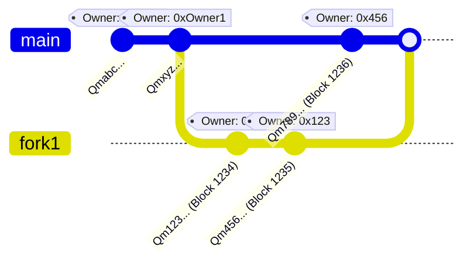

import { Bleed } from 'nextra/components'

# Hashchain

In the Open Internet Protocol (OIP), data integrity and verifiable history are fundamental. To achieve this, OIP uses a structure called a **Hashchain**. A Hashchain is a sequential chain of content states, each referencing the previous state through a unique content identifier (CID).

## Concept of a Hashchain

A Hashchain creates an immutable sequence of content updates by linking each new update to the previous update using a unique content identifier (CID). This forms an unalterable history, ensuring data authenticity and enabling easy verification of historical changes. 

Each update contains a special key, `previousCID`, which holds the CID (Content Identifier) of the preceding update. This establishes a tamper-proof chronological order:

```
Update 1 (Genesis) - CID: Qmabc... (previousCID: null)
    ↓
Update 2 - CID: Qmdef... (previousCID: Qmabc..., owner: 0xOwnerA, blockHeight: 100)
    ↓
Update 2 - CID: Qmxyz... (previousCID: Qmabc...)
    ↓
Update 3 - CID: Qmdef... (previousCID: Qmabc...)
```

This structure resembles a Git commit history, allowing for transparent tracking of changes and versions.

## Forks and Canonical Truth

Since OIP allows decentralized, distributed updates, forks may naturally occur. A fork is created when multiple updates reference the same `previousCID`, leading to parallel histories. To resolve forks and determine the canonical (official) state, each update is associated with a blockchain block height:

- **Blockheight** acts as the definitive source of truth.
- The state with the highest confirmed block height is considered canonical.
- Nodes can reject updates if the associated block height surpasses a certain threshold or if the timestamp associated with that block height exceeds an allowed epoch duration. Due to varying block times across different blockchains, this mechanism helps maintain consistency and security.

Consider the following example represented visually with a gitgraph:

<Bleed full>

</Bleed>

In this diagram:
- Commits represent state updates, each identified by their CID.
- Each update references a previous CID, creating a linked history.
- Owners (represented by Ethereum addresses) are associated with updates, clarifying who authored each update.

## Use Cases and Visualization

Hashchains allow applications built on OIP to visualize the entire state history and detect divergences quickly. Apps can visualize changes per OIP ID, owner (EVM address), application-specific data, and identify the canonical state clearly. This functionality can be especially useful for auditing, moderation, and transparency.

## Best Practices
- Always verify `previousCID` references to ensure integrity.
- Regularly prune outdated or stale states to optimize local storage, focusing primarily on the canonical state and relevant forks.
- Use the block number as the source of truth for determining canonical states and pruning invalid or excessively delayed updates.

## Integration Considerations

Applications using OIP should:
- Implement mechanisms to gracefully handle forks, presenting users with clear visualization or automated resolutions.
- Validate timestamps and block heights to reject outdated or potentially malicious updates.
- Regularly broadcast the canonical state to maintain consistency and improve data availability across nodes.

