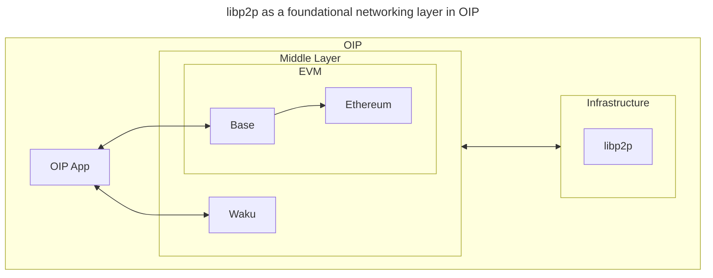

# libp2p
libp2p (short for "library peer-to-peer") is a modular, protocol-agnostic networking framework designed for decentralized, secure, and scalable peer-to-peer (P2P) communication. It provides a versatile foundation enabling resilient and interoperable decentralized applications, making it widely adopted in blockchain, messaging, and distributed storage systems.

For developers building on OIP, libp2p offers essential tools for creating highly resilient, secure, and decentralized applications.

## Introduction to libp2p

### Historical Context

Initially developed within the [InterPlanetary File System (IPFS) project](https://ipfs.io), libp2p has since evolved into a standalone framework adopted by numerous decentralized applications and protocols, including Ethereum, Filecoin, and Polkadot. Its growth stems from addressing common networking challenges such as peer discovery, secure communication, and transport diversity, becoming a foundational element in modern decentralized network architectures.

### Core Features

Key features of libp2p include:

- **Modularity:** Assemble customized protocol stacks tailored to specific application needs.
- **Transport Agnosticism:** Supports multiple transports (TCP, WebSockets, QUIC), ensuring connectivity in diverse network conditions.
- **Dynamic Peer Discovery:** Facilitates automatic peer discovery without centralized servers.
- **Security:** Provides secure peer identity verification and encrypted communications.
- **Resilience:** Robustly handles disruptions, maintaining network reliability and availability.

## Technical Architecture

### libp2p GossipSub

GossipSub is libp2p’s publish-subscribe protocol designed for efficient message propagation across decentralized networks:

- **Scalable Messaging:** Efficiently propagates messages with minimal latency and reduced bandwidth usage.
- **Dynamic Subscriptions:** Optimizes message delivery by dynamically managing subscriptions.
- **Fault Tolerance:** Maintains message delivery despite node failures or network partitions.

**Example GossipSub Subscription:**
```javascript
const libp2p = await createLibp2p({ /* libp2p config */ });
await libp2p.start();

const topic = 'oip-messages';
await libp2p.pubsub.subscribe(topic, (msg) => {
  console.log(`Received message: ${msg.data.toString()}`);
});
```

## libp2p in OIP

Within OIP, libp2p forms the backbone of decentralized communication, supporting key functionalities such as messaging, peer discovery, and data availability.


---

How OIP leverages libp2p:

- **Waku for Messaging:** OIP leverages Waku, derived from Ethereum’s Whisper protocol, providing secure and private decentralized messaging using GossipSub.
- **Peer Discovery and Routing:** OIP nodes dynamically discover and establish connections through libp2p's decentralized discovery protocols.
- **Transport Flexibility:** Supports multiple transport protocols to ensure message deliverability across various network conditions.
- **Integration with IPFS:** Recommends IPFS, built on libp2p, for decentralized data storage and availability.
- **Integration with Ethereum:** Utilizes libp2p to handle peer discovery, node communication, and transaction propagation. The consensus and execution layers rely on libp2p’s gossip and request-response protocols to exchange critical data such as transactions, blocks, and attestations. 

For further details on libp2p’s integration with blockchain consensus in OIP, refer to the [Blockchain page](./blockchain). Additional information on cryptographic signing and verification can be found on the [Signatures page](../data-structures/signatures).

Through libp2p, OIP establishes a robust and decentralized network architecture, fundamental for secure, scalable, and interoperable decentralized applications.

