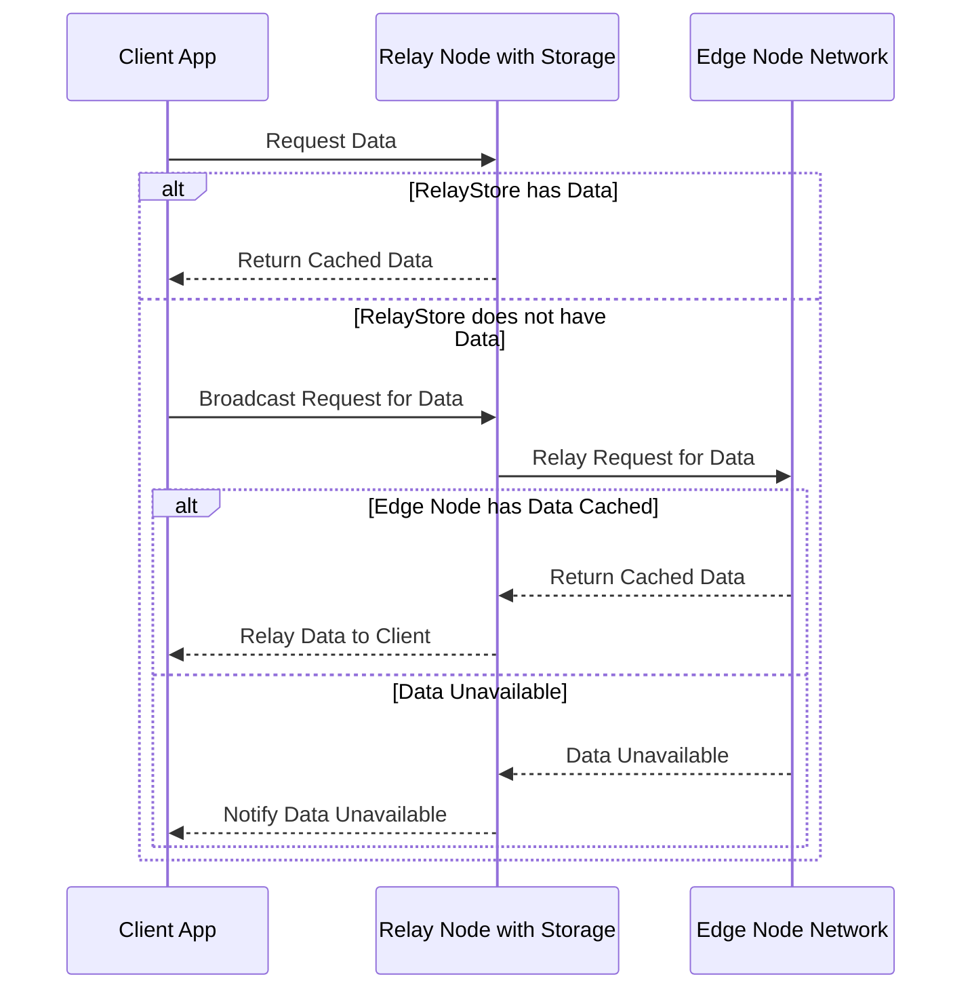

import { Bleed } from 'nextra/components'

# Edge Nodes

Edge nodes are fundamental components of the Open Internet Protocol (OIP), distinguishing it significantly from other decentralized systems. They provide lightweight, distributed, and resilient data storage capabilities directly at the client level, enabling OIP applications to achieve high availability without relying solely on centralized storage solutions or dedicated high-performance nodes.

## Overview

An edge node in OIP is essentially any user-operated device capable of maintaining persistent key-value storage. Common examples include web browsers, mobile applications, and desktop applications. By leveraging user-controlled storage, edge nodes form a decentralized layer of data redundancy and availability.

The design philosophy behind edge nodes is simplicity and resilience. They do not demand continuous uptime, high bandwidth, or substantial processing power. Instead, they operate efficiently on consumer-grade hardware such as mobile phones, laptops, and tablets, ensuring broad accessibility and usability.

## Storage Requirements and Efficiency

Edge nodes primarily store compact, compressed state messages averaging around 4KB per message. Given this lightweight nature, even a device with modest storage capacity can efficiently manage thousands of messages or state updates. For instance:

- **10,000 messages at ~4KB each** would require approximately **40MB of total storage**.

Such minimal storage requirements ensure that almost any modern consumer device can function effectively as an edge node without notable impact on its performance or usability.

## Recommended Storage Solutions

The choice of storage technology largely depends on the client environment:

### Desktop Applications
For desktop environments, a robust and reliable solution is to use lightweight storage modules like `electron-store`, particularly suitable for Electron-based apps. Electron-store is straightforward to implement, secure, and efficient, ideal for maintaining persistent storage on desktop edge nodes.

### Browser-based Applications
In web browsers, we recommend leveraging **IndexedDB**. It provides a reliable and standardized way to store substantial amounts of structured data persistently. However, developers should consider that IndexedDB storage can occasionally be ephemeral due to user actions such as clearing browser data or history.

In these scenarios, apps should:

- Maintain clear tracking of the data required to be cached locally.
- Implement mechanisms for automatically refetching essential state data from relay nodes or other edge nodes if local storage is cleared or data becomes unavailable.

## Resource Efficiency and Usability

Edge nodes are explicitly designed for consumer-grade hardware, emphasizing resource efficiency:

- **Low Memory Footprint:** Minimal resource utilization ensures that running an edge node does not degrade device performance or battery life significantly.
- **Bandwidth-Friendly:** Communication overhead is kept minimal, requiring only occasional synchronization and low data transfers.
- **Flexible Uptime:** Edge nodes do not demand constant availability, gracefully handling periods of intermittent connectivity, making them ideal for mobile and portable devices.

These characteristics ensure edge nodes are practical and effective solutions for everyday users, broadening participation in the network without imposing significant resource demands.

## Edge Nodes and Network Resilience

Edge nodes significantly enhance the resilience of the OIP network. By widely distributing data across user devices, the network becomes resistant to single points of failure and censorship. This decentralized redundancy ensures data availability even if centralized nodes or relays become temporarily inaccessible.

Moreover, the lightweight nature and ease of setup for edge nodes encourage broader participation among general users, further decentralizing and strengthening network reliability.

## Summary and Best Practices

- Use persistent, lightweight key-value storage such as IndexedDB (browser) or electron-store (desktop).
- Ensure applications can recover gracefully from storage losses by fetching data from other nodes.
- Optimize data to maintain small message sizes (~4KB) for efficient storage and transmission.
- Consider edge nodes as supplemental, resilient storage layers that significantly increase data availability and network robustness without high resource costs.

By adhering to these guidelines, application developers can effectively leverage edge nodes to enhance data integrity, network decentralization, and user accessibility within the Open Internet Protocol.
