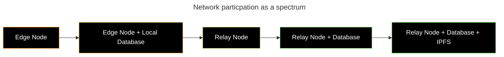

import { Bleed } from 'nextra/components'

# Relay Nodes

Relay nodes in the OIP network are Waku Relay nodes that facilitate decentralized, censorship-resistant, and scalable peer-to-peer messaging. They operate using the 11/WAKU2-RELAY protocol, which is a minor extension of libp2p GossipSub. Waku Relay nodes ensure message propagation across the network while prioritizing privacy, security, and resilience.

For developers building on OIP, understanding relay nodes is essential to designing applications that leverage decentralized messaging without relying on centralized infrastructure. These nodes play a key role in ensuring continuous communication between edge nodes and other participants in the network.

## Introduction to Relay Nodes

### Core Features
- **Decentralized Message Propagation**: Gossip-based dissemination ensures robust and efficient message relay.
- **Privacy-Preserving Design**: Publisher-message and subscriber-topic unlinkability protect user anonymity.
- **Censorship-Resistance**: The lack of central points of control makes message delivery resilient against external interference.
- **Dynamic Network Participation**: Nodes can join and leave without disrupting network stability.

## Technical Architecture

### Waku Relay Protocol
The Waku Relay protocol operates as a layer on top of libp2p GossipSub, introducing enhancements for privacy and security. It defines a specific protocol ID (/vac/waku/relay/2.0.0) and enforces strict message signing policies to prevent metadata leakage.

### Scalability and Participation Spectrum
Relay nodes exist on a participation spectrum where different levels of engagement determine their role in the network:

- **Edge Nodes (Light Participation)**:
  - Receive and send messages without relaying.
  - Often mobile or browser-based with limited resources.

- **Edge Nodes with a Database**:
  - Store and retrieve historical messages locally for better reliability.

- **Relay-Only Nodes**:
  - Forward messages but do not store them.
  
- **Relay + Store Nodes**:
  - Act as both a relay and a message store for offline retrieval.

- **Relay + Store + IPFS Nodes (Custom Implementation)**:
  - Provide full decentralization by integrating IPFS for additional data availability.
  - Developers writing custom relay binaries are encouraged to incorporate IPFS for persistent storage.

<Bleed>

</Bleed>

Developers building applications on OIP are encouraged to foster a participatory network by enabling users to run relay nodes or contribute storage.

## Relay Nodes in OIP
Relay nodes are fundamental to OIP's messaging layer, supporting:
- **Decentralized Communication**: Nodes propagate messages without intermediaries.
- **Efficient Peer Discovery**: libp2p's peer discovery mechanisms ensure seamless connectivity.
- **Flexible Transport**: TCP, WebSockets, and QUIC enable cross-platform compatibility.

For message security, Waku Relay must be combined with encryption mechanisms to ensure confidentiality. Developers should refer to the [Signatures page](../data-structures/signatures.md) for information on message verification.

## Economic Considerations: Incentivizing Relay Nodes
While relay nodes function in an altruistic manner similar to BitTorrent seeders, the scalability of Waku Relay depends on sustaining a healthy ratio of service nodes to edge nodes. Developers can encourage participation by:

- **Rewarding Higher Participation**: Applications can offer incentives for users who move up the participation spectrum (e.g., running a relay node instead of an edge node).
- **Leveraging the Waku Service Marketplace**: Waku is developing a decentralized marketplace where users can pay service nodes for message relaying and storage.
- **Exploring RLN for Spam Mitigation**: Rate Limiting Nullifiers (RLN) provide economic disincentives against spam while maintaining anonymity. [See RLN Relay](https://rfc.vac.dev/waku/standards/core/17/rln-relay/) for more details.

### The Waku Service Marketplace
Waku's vision for a decentralized service marketplace aims to:
- Remove the need for developers to run infrastructure.
- Enable direct funding for Waku services, either by users or applications.
- Allow applications to subsidize messaging costs for onboarding new users.

While Waku Relay remains fundamentally free, storage and advanced services may require economic incentives. Developers should consider integrating participation-based rewards and leveraging the upcoming Waku Service Marketplace.

## Conclusion
Relay nodes are the backbone of OIP’s messaging infrastructure, ensuring decentralized, private, and censorship-resistant communication. Developers are encouraged to design applications that promote user participation across the relay spectrum, optimizing for both efficiency and sustainability. By integrating incentivization models and leveraging decentralized storage options, OIP can achieve long-term scalability and resilience.

